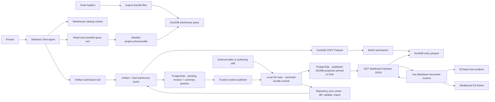

# Architecture notes



The data plane is two replaceable adapters. DuckDB is the grain store and the transformation engine: persistent per-project `.duckdb` files are attached as catalogs, authoring SQL runs there, accepted datasets are `COPY`'d to MinIO as Hive-partitioned summary Parquet, and dashboard GET hydrates those files with DuckDB `read_parquet`. Application PostgreSQL is the control plane: warehouse relation registry, revision records, Git publication state, run events, and pointers to summary prefixes. It does not store summary row payloads. Agents never receive warehouse or object-store credentials.

Governed names are `project.schema.table` triples registered in `warehouse_relations`. The bundled demo seeds `fashion.catalog.products` and `tlc.taxi.yellow_trips`; those can be replaced. JOINs among registered triples are allowed. There is no `source_data` compatibility view.

Source semantics are data, not application constants. Each relation stores dataset name, optional snapshot column, grain, cautions, DuckDB file, and a monotonically increasing source revision. Bootstrap fingerprints the whole catalog and records `warehouse:catalog@<snapshot-id>`. Grain tables are not copied into object storage.

Accepted dataset SQL is materialized as:

```text
summaries/dashboard=<uuid>/dataset=<id>/revision=<uuid>/version=<uuid>/as_of=<YYYY-MM-DD>/part_<uuid>.parquet
```

Exploration queries return ephemeral JSON and do not write that prefix. Dashboard GET hydrates widget rows from the summary store through DuckDB. Refresh appends a new `version=` prefix.

Generation events are persisted before being sent over SSE, so a reconnect can resume from `Last-Event-ID`. The UI exposes stage summaries only; model reasoning and raw provider events are never streamed.

A refinement first creates a pending complete artifact whose parent is the locked base revision. The trusted publisher acquires a process and PostgreSQL advisory lock, rechecks Git HEAD, branch, fingerprint, current dashboard base, bundle hash, and round-trip equality, then stages and commits only the stable dashboard path. Only after the commit exists does PostgreSQL mark the revision published/current. A commit-before-projection crash is recovered through the revision UUID trailer. Dirty or changed Git state retains the pending artifact as `publication_blocked`.

Restore verifies the source revision's recorded commit tree and artifact hash, copies its summary pointers into a new pending revision, and publishes a new commit. Neither Git nor PostgreSQL history is rewritten.

The bundle loader accepts only UTF-8/LF regular files with final newlines, fixed relative sidecar paths, matching IDs, and bounded total size. It rejects symlinks, traversal, unknown files, duplicate IDs, unsafe Markdown, ECharts resources/prototype keys, blocked D3 capabilities, and SQL outside the read-only `project.schema.table` allowlist. Manual changes additionally receive an expiring validation token bound to the complete repository fingerprint and fresh final-query results.

The optional analyst authoring skill uses the same dynamic catalog-context builder as Cline and can execute only the bounded `/api/authoring/queries` surface. It edits one canonical dashboard bundle, then delegates validation, warehouse queries, summary materialization, Git publication, and control-plane projection to the existing repository sync service. The helper contains no shell, Git, warehouse, or object-store execution capability.
